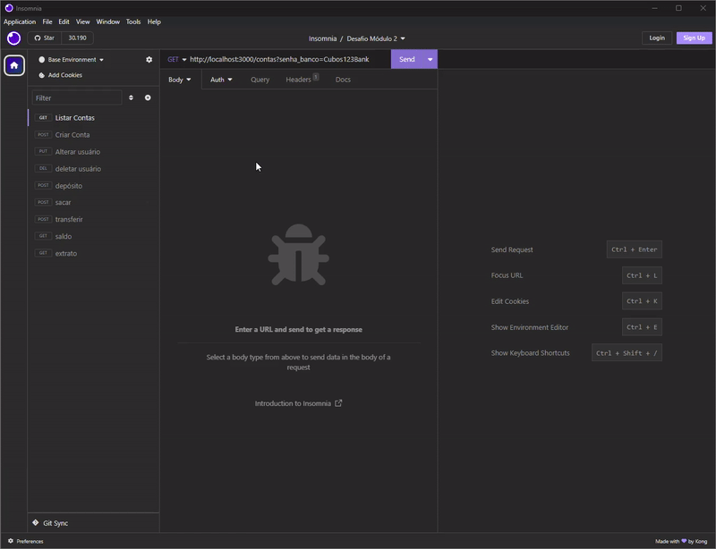
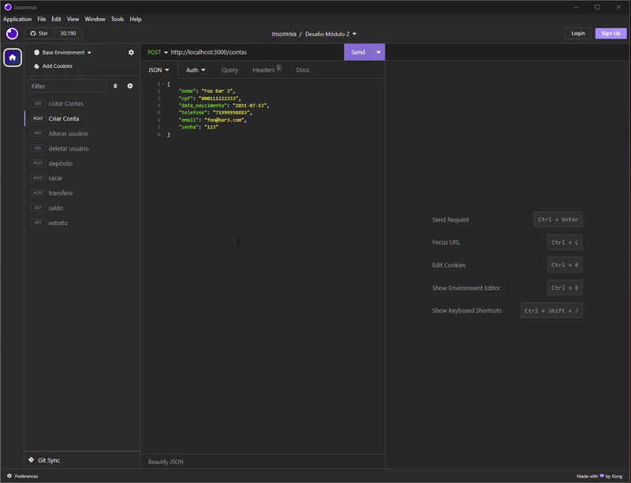
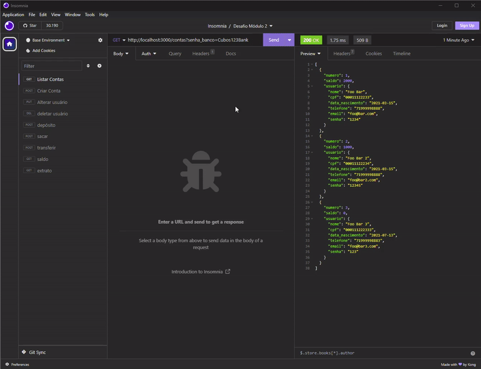
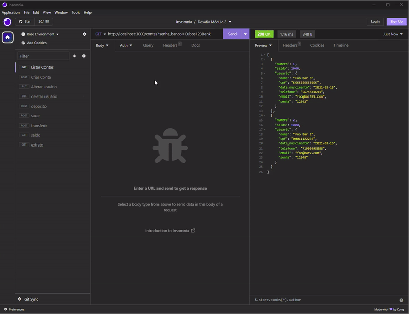
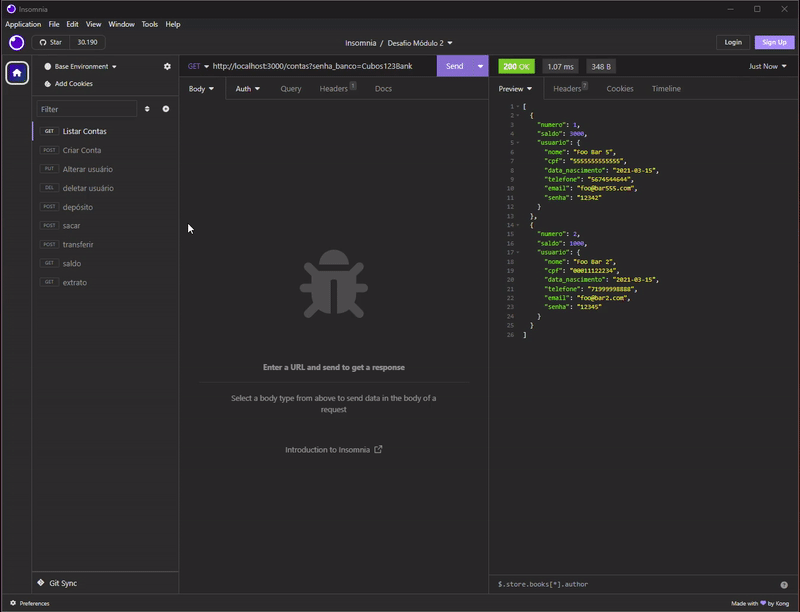
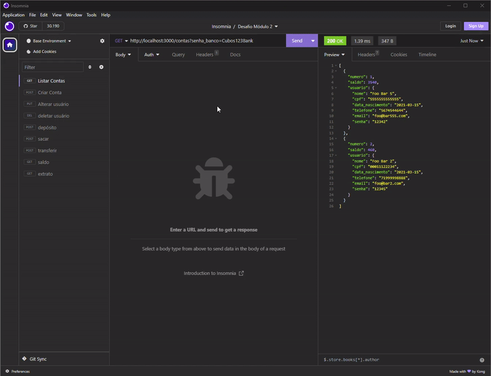
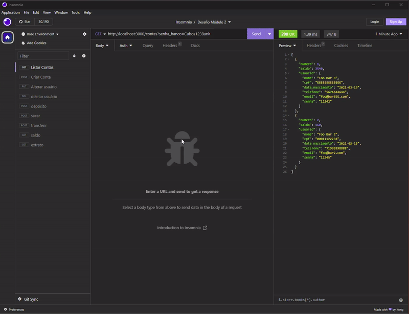

# Banco Digital - API REST

Este projeto é uma aplicação bancária desenvolvida em JavaScript, oferecendo funcionalidades, incluindo operações CRUD (Create, Read, Update, Delete) para gerenciar dados relacionados a contas bancárias, seguindo o padrão REST.

## Configuração do Projeto

Para começar a usar este projeto, siga os seguintes passos essenciais:

1. **Inicialização do Projeto:** Execute o comando `npm init -y` para inicializar o projeto com as configurações padrão.

2. **Instalação das Bibliotecas Necessárias:** Utilize o npm para instalar as bibliotecas essenciais do projeto. Execute os seguintes comandos:
    - ` npm install express ` para instalar o framework Express, que facilita a criação de APIs e rotas.
    - `npm install -D nodemon` para instalar o Nodemon como dependência de desenvolvimento, permitindo a reinicialização automática do servidor durante o desenvolvimento.
    - `npm install date-fns --save` para instalar a biblioteca date-fns, que será útil para manipular datas no projeto.

    
3. **Configuração da Porta do Servidor:**
Certifique-se de que a porta do servidor está configurada corretamente no arquivo de código-fonte. Por padrão, a porta é definida como `3000`, mas você pode escolher outra porta de sua preferência e fazer os ajustes necessários no código-fonte para refletir a nova porta.

4. **Iniciando o Servidor:** Utilize o comando npm start para iniciar o servidor da aplicação. Isso permitirá que o sistema bancário esteja pronto para atender às solicitações dos usuários.
    

## Testando o Sistema

Para testar as funcionalidades do sistema, existem duas opções:

**Usando o Insomnia:** Recomendamos o uso do programa Insomnia, que oferece uma maneira fácil e eficiente de interagir com a API do sistema. Você pode importar as requisições pré-configuradas disponíveis no projeto.

**Acesso Direto no Navegador:** Você também tem a opção de utilizar o sistema diretamente do seu navegador. Para isso, basta acessar os links disponíveis para as diversas operações oferecidas pela aplicação.

### Realiza as seguintes funções:

- Listar todas as contas: http://localhost:3000/contas?senha_banco=Cubos123Bank
- Criar Contas: http://localhost:3000/contas
- Alterar Usuário: http://localhost:3000/contas/1/usuario
- Excluir Usuário: http://localhost:3000/contas/2
- Depósito: http://localhost:3000/transacoes/depositar
- Saque: http://localhost:3000/transacoes/sacar
- Transferência: http://localhost:3000/transacoes/transferir
- Saldo: http://localhost:3000/contas/saldo?numero_conta=1&senha=12342
- Extrato: http://localhost:3000/contas/extrato?numero_conta=1&senha=12342

Este sistema bancário é uma solução completa e flexível para gerenciar contas bancárias, oferecendo a escolha da porta do servidor e a conveniência de testes tanto com o Insomnia quanto diretamente no navegador. 

## Funcionalidades

**Listar todas as contas:**

São listadas todas as contas de usuários cadastrados.  

 **Criar contas:**

Criada novas contas e as adiciona às contas de usuários existentes.  

**Alterar usuário:**

Altera dados de usúarios já cadastrados, desde que seu cpf e e-mail não constem em outra conta.  

**Deletar usuário:**

Deleta usuário cadastrado, desde que o saldo da conta seja igual a zero.  

**Depósito:**

Realiza depósito para as contas já cadastradas.  

**Saque:**

Realiza depósito para as contas já cadastradas.  

**Transferência:**

Realiza transferência de valores entre as contas já cadastradas.  

**Saldo:**

Faz conferência do saldo da conta.  

**Extrato:**

Devolve, na tela, toda a movimentação feita pela conta informada.  

 

## Tecnologias utilizadas:

 

  

  
  
  
          
          

